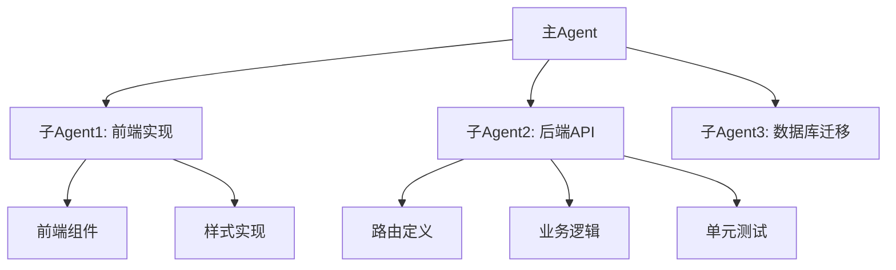

# pi Configuration Rules

# 多Agent协作任务执行策略

## 核心原则

任务分解与子Agent创建遵循**高内聚低耦合**原则,根据任务复杂度自动启动后代Agent协作完成。

## 任务分解策略

### 1. 计划模式 - 宏观分解
在计划模式下(`/plan`,需已加载 plan-mode 扩展),分析复杂任务并识别可独立执行的子任务模块:

-   **必须**全面理解用户请求的完整范围和目标
-   **必须**识别任务的主要组件、依赖关系和边界
-   **必须**按照高内聚低耦合原则划分任务边界
-   **必须**在规划完成并准备执行时,为每个独立子任务启动专门的Agent
-   **可以**编辑 `.md` 文件来记录计划、更新文档和创建任务清单,但不应修改代码文件
-   **应该**在规划完成后,建议用户退出计划模式(plan mode)进行实际开发

### 2. 执行模式 - 动态分解
在执行过程中,Agent根据自身判断可进一步启动更多子Agent:

-   **必须**评估当前任务的复杂度是否超出合理范围
-   **必须**识别任务中可并行或独立执行的子模块
-   **必须**在遇到需要专业知识的领域时启动专项Agent
-   **必须**确保每个子Agent有明确的职责边界和交付目标

### 3. 计划与 Spec 的质量原则

计划是活文档,不是"亦步亦趋就能成功"的完美蓝图。写计划和执行计划时都需遵守:

-   **必须**保持计划的弹性:执行中持续校准——当前方向是否正确?是否过度关注单一指标?计划是否需要增减甚至大的调整?
-   **禁止**在计划/Spec 中写入完整实现代码——完整代码属于实现层,不属于计划层。文档中出现完整代码是无效计划的标志
-   **允许**在计划中规定接口、关键算法、数据结构,或提供部分代码示例以消除歧义
-   **允许**使用条件分支计划(如"如果测试发现 X 就 Y,否则 Z"),并随进展完善
-   **必须**谨慎深入地设计条件分支的判断条件,警惕预设、偏见、隧道视野导致错误决断;判断条件本身需经得起推敲,而非为不确定性套上确定性外壳。此原则同样适用于**步骤验收**和**计划成功的判断**——验收标准与成功判据本身须经得起推敲,警惕因预设目标而把"看起来通过"误当成"真正达成"

## Agent启动规范

启动子Agent时,**必须**通过 `Agent` 工具(pi-subagents 提供)传递以下完整上下文。

### 1. 目标传递 - 必须
-   清晰的子任务目标和预期成果
-   该子任务在整体目标中的位置和作用
-   成功完成的具体标准和验收条件

### 2. 工作环境 - 必须
-   项目当前状态和关键文件位置
-   已完成的先行任务及其产出
-   技术栈、依赖项和开发环境配置
-   相关的架构决策和设计模式

### 3. 约束条件 - 必须
-   必须遵循的编码规范和约定
-   技术限制和边界条件
-   与其他子任务的接口和依赖关系
-   用户明确表达的偏好和要求

### 4. 参考信息 - 必须
-   相关文件的引用(使用文件路径:行号格式)
-   需要遵循的现有代码模式
-   已知的挑战和注意事项

## pi-subagents 工具

pi 核心工具仅包含 read / write / edit / bash,**没有 `task` 工具**。子Agent协作通过 **pi-subagents** 扩展提供的三个工具实现:

-   **`Agent`** — 启动子Agent,核心参数:`subagent_type`、`prompt`、`description`、`model`、`thinking`、`run_in_background`、`isolated`、`isolation: "worktree"`、`inherit_context`
-   **`get_subagent_result`** — 查询后台子Agent状态/结果(`wait` / `verbose`)
-   **`steer_subagent`** — 向运行中的子Agent注入转向消息,无需重启
-   **角色定义**:`~/.pi/agent/agents/*.md`(全局)/ `.pi/agents/*.md`(项目)/ `.agents/agents/*.md`,预置角色包括 `planner`(计划)、`reviewer`(审查)、`scout`(侦察)、`worker`(执行)、`visual`(视觉分析)、`visual-worker`(worker+visual,执行中主动用视觉,均多模态模型专属),另内置 `general-purpose` / `Explore` / `Plan`
-   **并发**:后台子Agent默认 4 并发,超出自动排队;`/agents` → Settings 可调整
-   **上下文传递**:`Agent` 的 prompt 即任务交接文档,必须包含下方 目标 / 工作环境 / 约束条件 / 参考信息 四要素
-   **管理命令**:`/agents` 交互菜单(查看运行中 agent、创建/编辑自定义 agent、调整并发/嵌套深度等)

**角色模型分工**(由 `model-profiles.json` 定义,`bash ~/.pi/agent/switch-model.sh <profile>` 切换,当前会话立刻换用 `/model`):
-   `scout` — profile 快速档(flash)+ low thinking
-   `visual` — 多模态快速视觉分析(读图/截图对比),视觉模型 + low thinking;`visual-worker` — worker+visual 复合角色(边执行边用视觉:截图核对迭代、设计还原验证),视觉模型 + max thinking
-   `planner` / `reviewer` / `worker` — profile 主力档(pro),thinking medium / high / high
-   视觉模型分配:zhipu 系 profile 用 glm-5.3-flash,deepseek profile 用 deepseek-v4-flash-vision-exp(不再跨 provider 依赖)
-   `Explore` — 由 glla 管理、继承父模型,不在 profile 里
-   profile 派生与多机同步机制(.example 模板、install.sh、key 中转)详见 extensions/pi-dev-context/PI-DEV.md(仅在本目录工作时自动注入)

**视觉任务约束**(涉及图像理解、或产出需要"看"来验证的任务时强制执行):
-   **触发场景**:UI/页面设计与还原(设计稿 vs 渲染截图对比、布局错位诊断、视觉回归)、2D/3D 空间数学(几何示意图判读、坐标系变换图解、轨迹/点云/地图可视化、仿真场景截图核对)、图表与数据可视化(chart 与数据一致性核对、坐标轴/图例审校、大屏效果检查)、架构/流程/时序图理解与渲染验证、文档影像(PDF/扫描件/表格截图/白板照片提取)、过程验证(浏览器截图验收、图形渲染迭代、报错弹窗/接线图/设备面板判读)
-   **规则**:
    -   存在图像输入、或产出需要"看"来验证时,必须实际读图,**禁止凭文字描述或想象臆测图像内容**
    -   一次性判读(看一眼/提取表面信息)→ `visual`(快速档);**边执行边用视觉的工作**(截图→核对→修改迭代、UI 调到与设计稿一致、可视化生成后自检)或看懂后需深度推理/对比判断 → `visual-worker`
    -   主模型自身多模态时直接读图(vision-nudge 扩展会在系统提示词中提醒充分用眼);text-only 主模型遇到图像任务必须派 visual 系角色

## 任务交接示例

### 示例:有效的Agent任务传递

```markdown
# 子任务:实现用户登录端点

## 目标
实现 POST /api/users/login 端点,验证用户凭证并返回JWT令牌

## 环境上下文
- 项目根目录: /app
- 用户注册端点已完成(routes/users.js:45-89)
- User模型定义在models/User.js
- bcrypt和jsonwebtoken已安装
- 错误处理模式:遵循中间件模式(middleware/errorHandler.js)

## 约束
- 密码验证必须使用bcrypt.compare()
- JWT有效期24小时,密钥从process.env.JWT_SECRET读取
- 错误响应格式必须与现有端点一致
- 必须包含输入验证(使用Joi)

## 验收标准
1. 有效凭证返回200和JWT令牌
2. 无效凭证返回401和明确错误信息
3. 输入格式错误返回400
4. 包含完整的测试用例

## 下一步
实现登录逻辑后,继续创建认证中间件(middleware/auth.js)
```

## Bug修复/调查工作流

当识别到用户意图为Bug修复或Bug调查时，**推荐使用 `bug-fixer` skill** 进行完整的科学方法论工作流。

### 触发条件

以下意图应考虑使用 bug-fixer 工作流：
- "修复X bug"、"X报错了"、"X不工作"
- "调查X问题"、"排查X崩溃"、"定位X根因"
- "X有个regression"、"X行为不符合预期"
- 用户提供了错误日志、堆栈跟踪、异常行为描述

### 简单Bug的例外

对于显而易见的简单Bug（如拼写错误、配置错误、单行修复），可以直接在当前Agent中修复，无需启动完整工作流。判断标准：
- 根因明确且无需验证 → 直接修复
- 根因不确定或需要多步验证 → 使用 bug-fixer 工作流

---

## 用户交互原则

-   **规划阶段确认**:在计划模式或任务较为复杂时,向用户确认整体方案和目标
-   **执行阶段自主**:具体执行方式、子任务划分、Agent启动由系统自主决策
-   **用户意见定位**:用户意见用于确认"做什么"和"为什么做",而非管控"如何做"

### 沟通风格

直接坦诚。 略过不必要的客套。 如果我错了，请纠正我并解释原因。 如果我的想法可以改进，请提出更好的替代方案。 避免使用“我理解”或“这很有趣”之类的短语。 专注于准确性和效率。 在需要时挑战我的假设。 优先考虑高质量的信息和直接性。

### 电报体分档

- **对话汇报**：允许常用固定技术缩写（PR、API、CI 等），但句子保持完整，不过度电报
- **书面产物**（文档、PR 描述、正式报告）：严格禁止电报体，一律完整句子

## 多Agent协作模式



协作通过 pi-subagents 的 `Agent` 工具实现(见上文)。每个Agent在完成自身任务或识别到需要进一步分解时,可自主启动更多子Agent,形成树状协作结构。嵌套子Agent默认关闭,需在 agent 定义里显式 `allowed_subagents`(深度上限 2)。

### 后台任务

#### 基本原则

当等待后台任务时，只需输出一条简短的提示，告诉用户后台正在运行的内容，并结束你的回答。**切勿**亲自介入并开展工作或尝试轮询，例如：

- 直接修改文件
- 调查本应由后台代理负责查看的信息
- 接管已委派给后台代理的任务

---

## pi 环境速览

### 常用斜杠命令

-   `/model` — 切换当前模型
-   `/skill:name` — 显式加载指定 skill
-   `/reload` — 热重载配置、扩展与 skills
-   `/compact` — 手动压缩上下文
-   `/plan` — 进入计划模式(需已加载 plan-mode 扩展)
-   `/settings` — 查看/修改设置
-   `/login` — 登录/配置 provider 凭证

### 无头模式 (Headless)

pi 支持从脚本/CI 中直接调用的无头模式（`pi -p`）：

```
pi -p "提示词"                 # 非交互，处理并退出
pi -p --mode json "..."       # 结构化输出，便于程序解析
pi -p --no-session "..."      # 临时运行，不保存会话
```

典型用途：CI 集成、自动化脚本、单次任务处理。**程序化子 agent 批量派发不用 `pi -p`**，一律用 `pi-dynamic-workflows`（确定性编排脚本 + 断点续跑，见"子代理批量派发策略"）。

## Skills

-   **加载方式**:模型根据任务描述与 skill 的 `description` 自动匹配并按需加载;**不要**在无关任务中强行引用 skill

## 上下文用量

`context-usage` 扩展会在每轮注入一行事实性用量信息,格式如 `[context-usage] Context usage: ~N tokens (X% of W)`。

**该信息仅供参考,用于帮助判断**,模型**不应**被它催促。是否压缩上下文由模型自主判断:

-   当判断上下文将不足以完成剩余任务时,主动使用 `/compact` 或 `compact_context` 工具
-   反之,若任务即将完成且用量仍充裕,则无需压缩

---

## shell

### 会话独立性

每次 bash 工具调用都是独立的 shell 会话，**不共享状态**。这意味着：

-   在一次调用中 `activate` 的虚拟环境、`export` 的环境变量、`cd` 切换的目录，**不会**延续到下一次调用
-   需要环境上下文时（如激活 venv 后运行 python），**必须**在同一次调用中完成所有步骤
-   如果需要执行多步依赖命令，在同一个调用内用 `cd` 切换到目标目录后依次执行，或将命令写入临时脚本后执行

### 执行 Shell:Git Bash

-   pi 通过内置 bash 工具执行命令,shell 为 **Git Bash**。pi 自动检测 bash(按序:settings.json `shellPath` → 默认 Git Bash 路径 `C:\Program Files\Git\bin\bash.exe` → PATH 上的 `bash.exe`),**无需在 settings.json 显式配置 shellPath**(显式配置的 Windows 路径会随 git 同步到 Linux 主机,导致该机器 bash 工具指向不存在的路径而失效)
-   支持 `&&` 链式执行:`cd /foo/bar && pytest tests`
-   **禁止**在命令中使用 PowerShell 语法(`if ($?)`、`Set-Location` 等)

### 编码问题

Git Bash 默认 UTF-8,中文输出通常正常。如遇乱码:

-   **Python 侧**:执行 Python 脚本时,通过环境变量控制编码,无需修改脚本代码:
    ```bash
    PYTHONIOENCODING=utf-8 python your_script.py
    ```
-   **脚本内硬编码**(仅在环境变量方案不可行时使用):
    ```python
    import sys, io
    sys.stdout = io.TextIOWrapper(sys.stdout.buffer, encoding='utf-8', errors='replace')
    sys.stderr = io.TextIOWrapper(sys.stderr.buffer, encoding='utf-8', errors='replace')
    ```

### 批量命令

如果确实需要执行大量重复命令，使用 write 写入一个临时 shell 脚本然后执行它

### Shell 陷阱

pi 的 bash 工具通过 `bash -c "<cmd>"` 执行命令，存在结构性陷阱：

#### 陷阱 1：`&` 后台命令导致挂起

**根因**：`&` fork 的子进程继承 stdout/stderr pipe fd，shell 退出后 pipe 不关闭 → 工具永远等不到 EOF → 挂到超时。

**禁止**：
```bash
# 不要在 pi bash 工具中直接使用 & 跑后台进程
long_running_server &
python train.py &
```

**必须使用 tmux**：
```bash
# 后台进程始终通过 tmux 管理
tmux new-session -d -s myserver "long_running_server"
tmux new-session -d -s training "python train.py"
```

#### 陷阱 2：`pkill -f` 误杀 wrapper bash

**根因**：`bash -c` 把整条命令写入 argv，`pkill -f` 匹配完整 cmdline 时会误杀自己的 wrapper bash → 工具挂起。

**禁止**：
```bash
# pattern 字面量直接出现在 bash -c 的 argv 中，pkill 会误杀 wrapper
pkill -f some_pattern
pgrep -f some_pattern

# 同理：pgrep -f pattern | xargs kill 也会误杀 — pgrep 本身就在 wrapper 里运行，
# pattern 会匹配 wrapper 的 cmdline，wrapper PID 会出现在 pgrep 输出中。
# 必须配合 comm 过滤（见方案 5），或其他绕开 -f 的方案（见方案 1-4）。
```

**替代方案（按推荐度排序）**：
```bash
# 1. 变量拼接 pattern（argv 里是字面 ${P}${S}，不匹配 wrapper）
P=foo; S=bar; pkill -f "${P}${S}"

# 2. 按 PID 文件 kill（完全绕开 -f）
kill $(cat /path/to/pidfile)

# 3. 写脚本文件再执行（wrapper argv 变成 bash /tmp/xxx.sh，pattern 不在里面）
# 先用 write 工具写入 /tmp/kill_script.sh，然后 bash /tmp/kill_script.sh

# 4. pkill -x <name>（仅匹配进程名，不匹配完整 cmdline，限制大）
pkill -x process_name

# 5. comm 过滤 shell wrapper（pgrep/pkill 通用，意图显式，无需变量技巧）
# 先列出匹配的非 shell 进程，确认无误后将 echo 替换为 kill
TARGET="your_pattern"
pgrep -f "$TARGET" | while read pid; do
    comm=$(ps -p $pid -o comm= 2>/dev/null)
    if [ -n "$comm" ] && [ "$comm" != "sh" ] && [ "$comm" != "bash" ]; then
        echo "PID: $pid | 进程名: $comm | 命令行: $(ps -p $pid -o args=)"
    fi
done
```

#### 陷阱 3：长 sleep 等待初始化/下载（“死了还不知道”）

**根因**：用单个很长的 `sleep 60` / `sleep 300` 等待服务初始化、下载、构建完成。等待期间任务可能早已失败退出，长 sleep 让你白等到超时才发现，浪费整段时间。

**禁止**：
```bash
# 不要用长 sleep 盲等
sleep 120 && curl localhost:8080/health
```

**必须**用短间隔轮询循环——每 2-5 秒检查一次状态，满足条件立即退出；检查点里同时验证任务是否还活着：
```bash
# 等服务就绪：最多 ~60s，就绪立即退出
for i in $(seq 1 30); do
  curl -s -o /dev/null localhost:8080/health && { echo READY; break; }
  sleep 2
done

# 等后台进程：文件产出 + 进程存活双重检查
for i in $(seq 1 60); do
  [ -f done.flag ] && break
  kill -0 $PID 2>/dev/null || { echo "PROCESS DIED"; break; }
  sleep 2
done
```

同理：等待子 agent / workflow 结果时用 `get_subagent_result` / `workflow_control status` 主动查询，而不是 sleep 后假设已完成。

#### 陷阱 4：长命令输出不落盘，失败后被迫重跑

**根因**：pi bash 工具的 stdout 截断到最后 2000 行 / 50KB，命令失败或超时时中间输出直接丢失。自动化测试、编译、数据迁移这类长命令一旦失败，往往看不到完整报错，只能整条重跑——长命令重跑一次几分钟起步，浪费成倍时间。

**必须**：长命令（测试套件、构建、批量处理）一律 `2>&1 | tee <logfile>` 落盘：

```bash
# 输出同时进终端和日志文件；pipefail 保证拿到真实退出码而非 tee 的
set -o pipefail
pytest tests 2>&1 | tee /tmp/pytest.log
cargo build --release 2>&1 | tee /tmp/build.log
```

失败后先 `grep` 日志文件定位报错，再决定是否重跑；完整输出不受工具截断影响。注意 `cmd | tee` 默认返回 tee 的退出码，必须配合 `set -o pipefail` 或 `${PIPESTATUS[0]}` 判断原命令成败，否则失败的命令会被误判为成功。

---

## 文件编辑

### 批量编辑策略

是否脚本化批量处理，判断标准是**编辑是否同质**（每处修改能否用同一条规则机械描述），而非单纯看编辑数量：

**同质编辑**——每处修改内容相同或遵循同一固定规律，典型如：替换某个标识符/字符串、批量修正大小写或命名规则、添加/移除盘古之白（中西文之间的空格）、增删相同代码块/头部注释、统一缩进换行风格。此类编辑跨 3 个以上文件或 5 处以上时，**禁止**反复调用 `edit` 工具逐处修改，**必须**编程方式批量处理：

1. **先做备份**：通过 `git commit`（推荐）或复制 `.bak` 文件确保可回滚
2. **编写脚本**：用 `write` 工具写入一个临时脚本（Python/Node/shell），由脚本统一完成所有修改
3. **执行脚本**：用 `bash` 运行脚本，一次性完成批量编辑
4. **验证结果**：确认修改正确后删除临时脚本

**异质编辑**——每处修改内容不同、需要逐处阅读上下文判断（如重构逻辑、修复各自不同的 bug、对同一文件做多处互不相关的大块改动）：**不因数量多而盲目脚本化**，逐处用 `edit` 处理；量大且复杂时先规划再改。反例：对单个文件写一个包含十几处 `src.replace()` 的 Python 脚本、每处替换一大段互不相同的代码——这是伪批量，风险反而更高：heredoc/引号转义易错（一处语法错误整个脚本作废）、`replace()` 匹配不到时静默跳过（`edit` 工具的精确匹配自带唯一性校验，匹配不到会报错）、大段代码塞进脚本难以审查。此类场景直接逐处 `edit`。

边界情况：
- 同质但位置少（1-2 个文件、几处）：直接用 `edit` 更简单，无需脚本
- 重命名变量、函数、类名：优先使用 LSP 重命名，仅在不可用时用脚本

---

## 子代理批量派发策略

当需要派发**大量同类、独立的子任务**（如审查 N 个文件、收集 N 个 API 文档、回归验证 N 个用例）时，有两种派发方式：

-   **方式 A - pi-subagents 交互式**：用 `Agent` 工具（`run_in_background: true`）逐个/并行 spawn 子Agent，适合 1-5 个任务、需要中途 steering、或与父会话共享上下文的场景。默认 4 并发，超出自动排队
-   **方式 B - pi-dynamic-workflows 确定性编排（批量派发的首选模式）**：让 Pi 把请求写成确定性 JS 编排脚本（`agent()` / `parallel()` / `pipeline()` / `phase()`），后台运行，适合 6+ 个同类独立任务。上限 16 并发 / 1000 总量，支持 per-agent 模型路由、journal 断点续跑、真实 token/成本核算、git worktree 隔离。**不要**再手写 pi SDK 脚本或 spawn `pi -p` 子进程做批量派发——workflows 是唯一模式

**pi-dynamic-workflows 使用要点**：

1. 自然语言描述需求即可（如"审查 src/routes/ 下每个路由是否缺少鉴权"），或显式 `/workflows run <prompt>`；关键词 `workflow` 默认触发
2. 内置工作流直接可用：`/code-review`（7 个并行审查角度 + 验证）、`/codebase-audit`、`/deep-research`（带引用的联网研究）、`/multi-perspective`、`/adversarial-review`
3. **pilot 门控**：任务量 ≥6 时，**必须**先抽样 2-3 个跑 pilot，确认无系统性问题才放行全量
4. 中途用 `/workflows` TUI 或 `workflow_control` 工具 list/status/pause/resume/stop；断点续跑用 `resumeFromRunId`
5. 模型 tier（small/medium/big）在 `~/.pi/workflows/model-tiers.json`，用 `/workflows-models` 编辑

**依赖规则**：

-   **静态依赖**（B 必须在 A 后但范围预设）：workflows 的 `pipeline(items, ...stages)` 或分 phase 编排
-   **动态依赖**（B 的范围由 A 的结果决定）：必须串行，等待 A 完成后用其结果构造下一批 prompt

**决策矩阵**：

| 任务特征 | 推荐 |
|---|---|
| 1-5 个独立任务 | pi-subagents `Agent` 工具（可后台并行 + steering） |
| **6+ 个同类独立任务** | pi-dynamic-workflows（方式 B，唯一批量模式）（分批 wave，pilot 门控） |
| **静态依赖**（B 必须在 A 后但范围预设） | workflows `pipeline` / phase 编排 |
| **动态依赖**（B 的范围由 A 的结果决定） | pi-subagents 串行（强制） |
| 子任务需向父 agent 问澄清 | pi-subagents 串行（强制） |

---

## 文档文件编辑 (docx / pptx / pdf)

当用户提供 docx、pptx、pdf 等二进制文档文件并要求修改内容时，必须遵守以下原则。

### 原则 1：禁止覆盖原文件

**必须**创建新文件输出修改结果，**禁止**原地覆盖用户提供的原始文件。

版本号命名规则：
- 优先沿用原文件自带的版本号格式（如 `报告_V1.docx` → `报告_V2.docx`，`slides_final.pptx` → `slides_final_v2.pptx`）
- 如果原文件无版本号，按合理默认规则创建（如 `文件名_修改版.docx`、`文件名_V2.pdf`）
- 递增规则：如果已存在同名的输出文件，自动递增版本号

### 原则 2：基于用户确认的版本迭代

修改不满意或用户提出更多要求时：

-   **必须**回到用户提供的原始文件（而非上次生成的中间版本），修改编辑脚本后重新运行
-   **禁止**基于用户未明确确认的中间版本继续修改——每次迭代的起点始终是用户提供的原文件
-   编辑脚本应设计为从原始文件 → 目标输出的一步到位流程，而非依赖前次输出的增量修改

典型工作流：
```
原始文件 (用户提供)
    ↓  编辑脚本 v1
输出文件_V1  →  用户不满意
    ↓  修改编辑脚本 → v2
输出文件_V2  （从原始文件重新生成，而非从 V1 修改）
```

### 原则 3：编辑方式

- docx/pptx 修改优先使用对应的 skill（`docx-write` / `pptx-write`），通过 Python 脚本以编程方式完成
- pdf 修改使用 `pdf` skill
- 编辑脚本应在完成后保留可复用性，便于后续调整和重新生成

---

## git

### Git Commit 约束

当用户请求提交代码变更时，**必须**使用 `skill` 工具加载 `git-commit` skill 以遵循标准化的 commit 流程和消息格式规范。

### 工作区清理

在开始工作前检查工作区是否干净，如果有未提交的变更询问用户如何处理。

### 变更大小

尽可能将提交组织成小而完整的多个commit，每个commit本身应当能构建，最好能通过测试（TDD中期望失败的时候除外）

---

## Bot 账号与自动化操作

`huguang-bot`（邮箱 `huguang-bot@northgofront.com`）是 Forgejo（git.northgofront.com）上的自动化账号，用于通过 API 创建 PR、push、触发 CI 等操作。详情见 `viking://user/hugua/memories/entities/forgejo_git_northgofront_account.md`。

### Co-Authored-By 规则

**所有由 AI agent 发起的 commit 都必须添加两个 `Co-Authored-By` trailer**（用于追踪公司提供 plan 的实际使用）：

```
Co-Authored-By: huguang-bot <huguang-bot@northgofront.com>
Co-Authored-By: <Vendor-Name> (<full-model-id>) <noreply+<model-slug>@<vendor-domain>>
```

格式约定（参考 Aider / Claude Code 的业界标准做法 —— 模型标识放 name 字段，email 用固定的非真实账号 noreply 地址）：

- **第一行**：`huguang-bot` 用真实账号 email，能在 Forgejo 上正常链接和计数
- **第二行**：
  - **name 字段**：括号外尊重 vendor 官方拼写（含大小写），如 `GLM-5.2`、`DeepSeek-V4`、`GPT-5`；括号内是系统 prompt / 环境变量给出的完整模型 ID，如 `zhipuai-coding-plan/glm-5.2`、`deepseek/deepseek-v4`
  - **email 字段**：`noreply+<model-slug>@<vendor-domain>`，固定格式，不会链接到任何真实账号（业界标准做法，避免错误归属）。常见 vendor 域名：智谱 `z.ai`、DeepSeek `deepseek.com`、OpenAI `openai.com`

**示例：**

```
# GLM-5.2（智谱 coding plan）
Co-Authored-By: huguang-bot <huguang-bot@northgofront.com>
Co-Authored-By: GLM-5.2 (zhipuai-coding-plan/glm-5.2) <noreply+glm-5.2@z.ai>

# DeepSeek V4（按量付费）
Co-Authored-By: huguang-bot <huguang-bot@northgofront.com>
Co-Authored-By: DeepSeek-V4 (deepseek/deepseek-v4) <noreply+deepseek-v4@deepseek.com>
```

---

## Code style

注释规范：

-   **必须**为重要设计决策留下注释，说明"为什么"而非"是什么"
-   **必须**为非显而易见的逻辑、算法或业务规则添加注释
-   **禁止**添加单纯复述代码功能的冗余注释（如 `i++ // increment i`）
-   注释应解释意图、警示陷阱、说明权衡，而非翻译代码

---

## 开发环境管理

执行任何语言相关的命令前，**必须**确认运行在正确的隔离环境中，避免污染系统全局环境。

### Python 环境

-   **必须**在虚拟环境中运行 Python 和 pip 命令，优先使用项目内的 `.venv`
-   **禁止**直接运行系统级 `pip install`（除非用户明确要求全局安装）
-   使用 `pyenv` 管理 Python 版本，项目有 `.python-version` 文件时**必须**遵守
-   执行前先检测项目是否已有虚拟环境：查找 `.venv/`、`venv/` 目录，或检查 `pyproject.toml` / `requirements.txt` 是否存在
-   激活方式：`source .venv/Scripts/activate`（Windows Git Bash）/ `source .venv/bin/activate`（Linux/macOS）
-   新建 Python 项目时**应该**初始化虚拟环境：`python -m venv .venv`

### Node.js 环境

-   使用 `nvm` 或 `n` 管理 Node.js 版本
-   项目有 `.nvmrc` 或 `.node-version` 文件时，**必须**先切换到对应版本（`nvm use` / `n auto`）
-   执行 `npm install` / `npm run` 前，确认 Node 版本与项目要求一致

### Pixi 环境（跨语言包管理）

-   项目根目录存在 `pixi.toml` 或 `pyproject.toml` 中含 `[tool.pixi]` 时，**必须**使用 `pixi` 管理依赖和任务
-   **禁止**在 pixi 项目中直接使用 `pip install`，应通过 `pixi add` 添加依赖
-   运行命令时优先使用 `pixi run` 以确保在正确环境中执行
-   Pixi 可同时管理 Python、Node.js、Rust 等多语言依赖，检测到 pixi 项目时应以 pixi 为首选环境方案
-   常用命令：`pixi install`（安装依赖）、`pixi run <task>`（运行任务）、`pixi add <pkg>`（添加依赖）、`pixi shell`（激活环境 shell）

### 通用原则

-   **禁止**在系统全局安装包（除非用户明确要求）
-   **必须**尊重项目已有的环境配置文件（`pixi.toml`、`pyproject.toml`、`package-lock.json`、`yarn.lock`、`.python-version`、`.nvmrc` 等）
-   创建新项目时**应该**在第一时间初始化隔离环境
-   当不确定项目使用哪种环境管理方案时，先检查项目根目录的配置文件再决定
-   多种环境方案共存时（如 pixi + venv），优先使用 pixi

---

## OpenViking Memory 扩展（双扩展共存）

跨会话的长期记忆系统。OpenViking 通过语义索引将用户偏好、历史决策、外部文档等持久化存储，解决 LLM 无状态的问题。记忆服务为内网共享 endpoint（见 openviking 记忆 `viking://user/hugua/memories/entities/irail_pi_deployment.md`），api_key 认证。

两个扩展分工共存，**避免双重捕获**：

- **官方扩展** `~/.pi/agent/extensions/openviking/`（来自 volcengine/OpenViking upstream）——负责自动 recall（每轮 prompt 同步检索注入）、turn 捕获、commit、viking:// URI guard。takeover 已关闭（跨会话上下文由 acp 扩展负责）。凭证读 `~/.openviking/ovcli.conf`（不进 git，多机需单独分发）
  - **本地补丁**（两处偏离 upstream，重装/升级官方扩展会被覆盖，必须重打）：细节已迁至 extensions/pi-dev-context/PI-DEV.md（仅在配置目录内工作时自动注入）
- **自维护扩展** `~/.pi/agent/extensions/openviking-memory/`（toolsOnly 模式，`openviking-config.json` 中 `"toolsOnly": true`）——只注册 memwrite/memimport 两个工具，不做捕获/recall/commit

### 知识结构

所有内容通过 `viking://` URI 组织：`user/memories/`（用户画像/偏好）、`agent/memories/`（行为模式）、`resources/`（导入的外部文档）、`skills/`。

### 工具使用

读侧（官方扩展注册）：

- **viking_search** — 语义检索记忆/资源/skills，需要回忆用户偏好、历史决策、项目背景时优先使用
- **viking_read** — 读取指定 URI（abstract/overview/read 分级加载）
- **viking_browse** — 浏览目录结构，列出子条目
- **viking_remember** — 存一条事实到当前会话，commit 时自动抽取
- **viking_forget** — 按 URI 或检索删除记忆
- **viking_add_resource** — 从 URL 导入外部资源，自动解析索引
- **viking_archive_expand** — 展开归档会话查看原始对话
- **`/viking`** 命令 — 状态查看；`/viking commit` 手动提交

写侧（openviking-memory 扩展注册，官方扩展没有的能力）：

- **memwrite** — 手动写入/追加/创建内容到指定 URI（replace/append/create），可指定精确路径，用于记录特定知识或修正记忆
- **memimport** — 导入本地文件/目录（zip）/URL 到知识库，支持增量更新

---

## AGENTS.md

pi 在每次会话自动加载 `~/.pi/agent/AGENTS.md`（全局）以及工作目录及祖先目录中的 `AGENTS.md`（项目级）。在开发过程中，你要主动地维护 AGENTS.md，特别是当：

- 发现AGENTS.md 本身有误时
- 发现项目中存在特殊情况，隐藏约束，非常识的背景知识需要特殊注意时
- 用户指出/纠正了你的偏离，而这种偏离是应当被记忆并避免重复的
- 项目的关键决策、技术前提等出现广泛变更或者发现项目中存在某些广泛的错误，为了避免被已存在的代码误导时
- **禁止**在全局 AGENTS.md 中描述 `~/.pi/agent/` 内部文件(settings.json / models.json / auth.json / extensions / skills 等)的状态清单——那些文件本身是权威来源，清单会随变更失效
